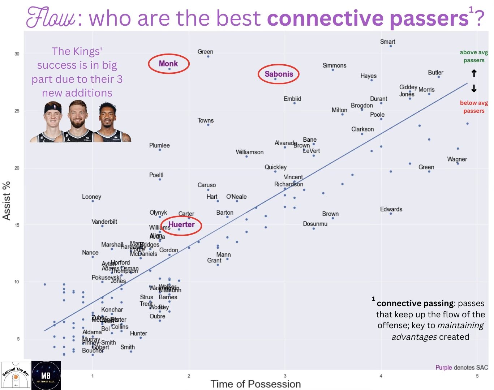

# Connective Passing Analysis
Quantifying 'Connective Passing' Ability Using Tracking Data to Explain the Success of the Sacramento Kings' Offensive System.

[Code (click here)](https://github.com/yashwantsathish/Connective-Passing-Analysis/blob/main/ConnectivePassingAnalysis.ipynb)

Methodology:
1. Pulled/Scraped 600+ data values from stats.nba.com API (using py_ball python wrapper) and basketball-reference.com.
2. Imported data into Python as Pandas DataFrames and cleaned data to remove errors, duplicates, and irrelevant values.
3. Merged dataframes by player name using Pandas functionality.
4. Used Python libraries Seaborn and Matplotlib to create scatterplot plotting 'Assist %' against 'Time of Possession'. 
5. Used Python's NumPy library to generate and plot line of best fit -- meant to denote 'average' connective passing ability.
6. Touched-up in Canva for user-friendliness.

