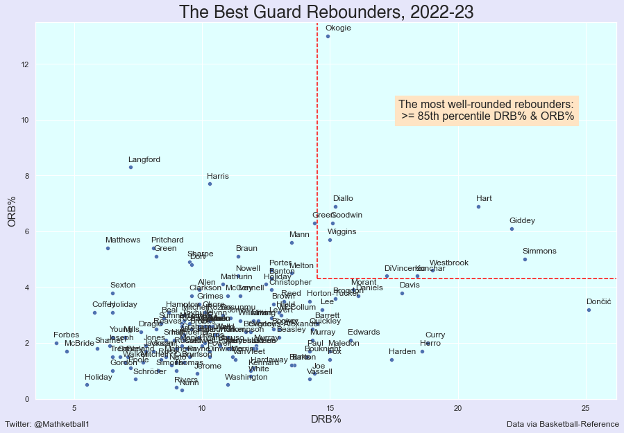

# Guard Rebounding Analysis
Utilizing data to identify the best &amp; most well-rounded guard rebounders in the NBA.

[Code (click here)](https://github.com/yashwantsathish/Guard-Rebounding-Analysis/blob/main/Guard%20Rebounding%20Analysis.ipynb)

Methodology:
1. Scraped 100+ data values from Basketball Reference data table (rebounding data) to Excel.  
2. Performed Data Cleaning in Excel to remove errors, duplicates, and irrelevant data from raw datasets.
3. Imported data from Excel into Python as Pandas DataFrame.
4. Deduced that scatterplot was most appropriate & used Python libraries Seaborn and Matplotlib to plot 'OREB% against 'DREB%'.
5. Calculated the 85th percentile marks for ORB% (Offensive Rebounding Percentage) and DRB% (Defensive Rebounding Percentage) and plotted a 'box' enclosing these values using matplotlib to denote the most well-rounded rebounders.

