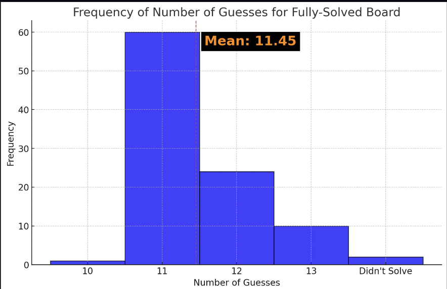

# Octordle-AI

# Team Members -  Akhil Elamanchili, Yashwant Sathish Kumar, Sid Meka, Riley Froomin, Krishan Patel

## Acknowledgments

This project is developed as part of the CSC 480 course at Cal Poly, under the supervision of Dr. Rodrigo Canaan

## Credits

- The information algorithm used for solving Octordle draws inspiration from the General Solver script (general_solver.py) by [Nuo Wen Lei](https://github.com/NuoWenLei/Wordle_Solver).
- The user interface for playing Octordle is built using the tkinter library in Python.

## Installation

To run this project, you need to have Python installed on your system.

1. Install the required dependencies:

```
pip install numpy
```


## Playing Octordle

To play Octordle with the AI agent, please follow these instructions:

1. Open your terminal and navigate to the project directory.
2. Execute the main Python script by running the following command:
```
python UI.py
```
The AI agent will play the game automatically, and the process will take approximately 1 minute to complete.


## Results

Since there's no automated validation process available, the algorithm's performance was assessed by running Octordle manually 100 times. Here are the results:



As observed from the results, the AI agent is able to solve the game in approximately 11.45 guesses on average.
